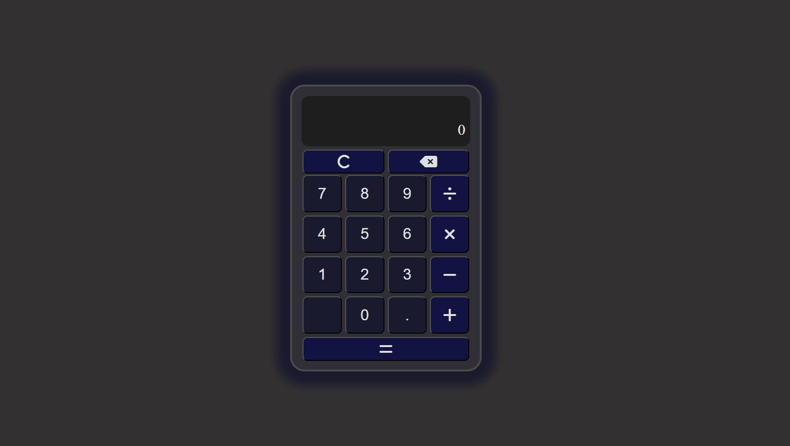

# Calculator
Basic calculator application.

## Used technologies:
- `Javascript (ES6+)`
- `HTML`
- `CSS`
- `Unit tests (JEST)`

## Functions
- adding
- subtraction
- multiplication
- division

## Demo

